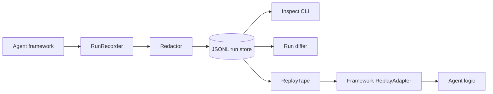
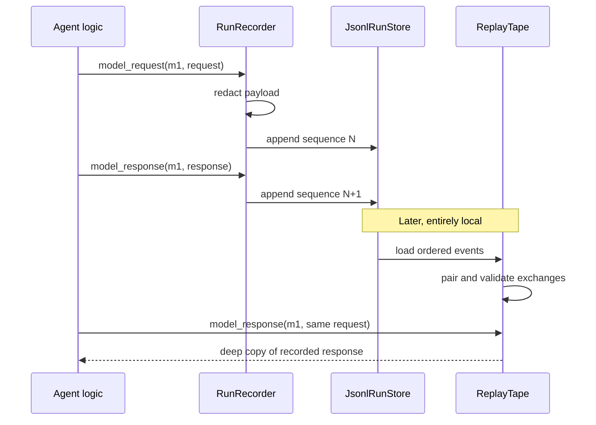

# Agent Run Replay

Record, inspect, structurally diff, and deterministically replay agent executions on a local machine.

## Problem Statement

Agent failures are hard to reproduce because model responses, tool results, state transitions, and external systems vary between executions. Logs show fragments but rarely preserve the ordered requests and responses needed to drive the same application logic again.

## What This Project Solves

Agent Run Replay records an append-only stream of typed execution events in JSONL. A replay tape pairs recorded model and tool requests with their recorded responses, validates that replayed requests match exactly, and returns local copies of those responses. No model or tool client is accepted by the replay API, so replay itself performs zero external calls.

The package includes:

- run and session metadata
- model request/response events
- tool request/response events
- state snapshots and deltas
- recursive sensitive-key redaction
- strict deterministic replay matching
- structural run comparison
- `inspect`, `replay`, `diff`, and `list` CLI commands
- JSONL storage with sequence validation and optional `fsync`
- protocol-based framework adapters

## When To Use It

Use this package while developing or operating agents whose decisions depend on nondeterministic model outputs or variable tool responses. It is useful for incident reproduction, regression tests, agent-logic debugging, and comparing behavioral changes between versions.

Replay returns recorded values; it does not reproduce arbitrary side effects. Application code should use replay adapters instead of live model and tool clients during a replay run.

## Architecture / HLD



Recording and replay are intentionally separated. Recording adapters translate framework activity into generic events. Replay adapters receive a `ReplayTape`, not network clients, and request responses by recorded `call_id` plus the expected request.

## Detailed Design / LLD



Each file is named `<run_id>.jsonl`. Every line is a complete event object with schema version, run ID, sequence, kind, timestamp, and payload. The store rejects unsafe run IDs and non-contiguous appends. Loading validates every line and reports the failing line number.

Replay requires one response for every recorded request, rejects duplicate call IDs, validates model request bodies, tool names, and tool arguments, and can assert that all exchanges were consumed.

## Public API / API Structure

| API | Responsibility |
| --- | --- |
| `RunMetadata`, `RunEvent`, `EventKind` | Immutable execution model |
| `RunRecorder` | High-level append-only recording |
| `JsonlRunStore` | Local persistence and sequence checks |
| `KeyRedactor`, `Redactor` | Recursive built-in and custom redaction |
| `ReplayTape` | Exact request matching and recorded response lookup |
| `ReplayAdapter`, `replay_with` | Framework replay integration |
| `diff_runs`, `RunDiff` | Timestamp- and run-ID-independent structural comparison |
| `summarize`, `RunSummary` | Run inspection metadata |

## Core Concepts

### Event stream

Events are immutable and ordered by a zero-based contiguous sequence. Supported kinds are run start/completion/failure, model request/response, tool request/response, state snapshot, and state delta. Schema version `1` is validated on read.

### Call IDs

Every model or tool exchange needs an application-generated call ID that is unique within its category and run. Replay uses it as the stable identity and also checks the full request. A reused ID or changed request fails explicitly rather than returning the wrong response.

### Redaction

Redaction occurs before an event reaches the sink. `KeyRedactor` walks nested objects and lists case-insensitively. Custom redactors implement the `Redactor` protocol and return a JSON-compatible dictionary.

## Local Prerequisites

- Python 3.11 or newer
- Git
- No database, model API key, or hosted service

## Steps To Run

```bash
git clone https://github.com/aniket-deshkar/agent-run-replay.git
cd agent-run-replay
python -m venv .venv
```

Activate the environment, then install and verify:

```bash
python -m pip install -e ".[dev]"
ruff check .
ruff format --check .
pytest
python -m build
```

## Configuration

The library has no global configuration file. Configure objects explicitly:

```python
store = JsonlRunStore(".agent-runs", fsync=True)
redactor = KeyRedactor({"authorization", "api_key", "password"})
```

The CLI accepts `--store PATH` before its subcommand and defaults to `.agent-runs`.

## Usage Examples

Record a run:

```python
from agent_run_replay import JsonlRunStore, KeyRedactor, RunMetadata, RunRecorder

store = JsonlRunStore(".agent-runs")
recorder = RunRecorder(
    store,
    RunMetadata("support-20260818-001", session_id="session-42", agent="support"),
    redactor=KeyRedactor({"authorization", "api_key"}),
)

recorder.model_request("model-1", {"messages": [{"role": "user", "text": "Help"}]})
recorder.model_response("model-1", {"text": "I will check the account."})
recorder.tool_request("tool-1", "account_lookup", {"account_id": "A-42"})
recorder.tool_response("tool-1", {"status": "active"})
recorder.state_snapshot({"step": 2, "status": "active"})
recorder.complete({"answer": "The account is active."})
```

Replay in a framework adapter:

```python
from agent_run_replay import ReplayTape

tape = ReplayTape(store.load("support-20260818-001"))
model = tape.model_response("model-1", {"messages": [{"role": "user", "text": "Help"}]})
tool = tape.tool_response("tool-1", "account_lookup", {"account_id": "A-42"})
tape.assert_consumed()
```

Inspect and compare:

```bash
agent-run-replay --store .agent-runs list
agent-run-replay --store .agent-runs inspect support-20260818-001 --events
agent-run-replay --store .agent-runs replay support-20260818-001
agent-run-replay --store .agent-runs diff before-change after-change
```

`diff` exits with `0` for equal runs, `1` for differences, and `2` for invalid input or storage errors.

## Testing

The test suite covers serialization, invalid schemas, append ordering, path traversal, corrupt files, resource closure, recursive redaction, model and tool mismatch failures, missing exchanges, run diffs, summaries, and all CLI paths. The central acceptance test replays both a model response and a tool response with no external provider object.

CI runs lint, formatting, 29 tests, source-distribution creation, and wheel creation on Python 3.11 and 3.14 without credentials.

## Observability

The event stream is the local diagnostic record. CLI inspection reports event counts and terminal state; `--events` emits the full stored stream. Applications may add nonsensitive correlation IDs to run attributes.

This package does not transmit telemetry or provide a hosted interface.

## Security

- Configure redaction before the first event is recorded.
- Redact credentials at their source as well as in this recorder.
- Keep `.agent-runs/` outside version control and apply appropriate filesystem permissions.
- Treat prompts, tool arguments, model responses, and state as potentially sensitive.
- Run IDs are restricted to safe filename characters to prevent path traversal.
- Do not interpret replay as authorization to repeat a recorded side effect.
- See [SECURITY.md](SECURITY.md) for private reporting.

## Repository Structure

```text
src/agent_run_replay/
├── model.py       event and metadata types
├── recorder.py    high-level event recording
├── redaction.py   redaction protocol and key redactor
├── storage.py     append-only JSONL storage
├── replay.py      deterministic replay tape and adapter API
├── diff.py        structural comparison
├── inspect.py     run summaries
└── cli.py         command-line interface
tests/             deterministic test suite
.github/workflows/ci.yml
```

## Design Decisions / Trade-offs

- JSONL keeps runs inspectable and append-friendly without a database dependency. It favors one writer per run; the store validates sequence order rather than coordinating distributed writers.
- Replay uses exact request equality. This catches behavioral drift early but requires adapters to produce stable JSON-compatible request shapes.
- Responses are deep-copied before return so replaying application code cannot mutate the tape.
- Diffs compare event position, kind, and payload while ignoring timestamps and run IDs. This makes repeat executions comparable but does not perform semantic alignment after inserted events.
- Redaction is a hook because sensitive fields are application-specific. The built-in key redactor is deliberately conservative and easy to audit.

## Contributing

See [CONTRIBUTING.md](CONTRIBUTING.md). Add deterministic positive and failure tests for storage or replay changes and run the complete verification commands before opening a pull request.

## License

Licensed under the Apache License 2.0. See [LICENSE](LICENSE).
